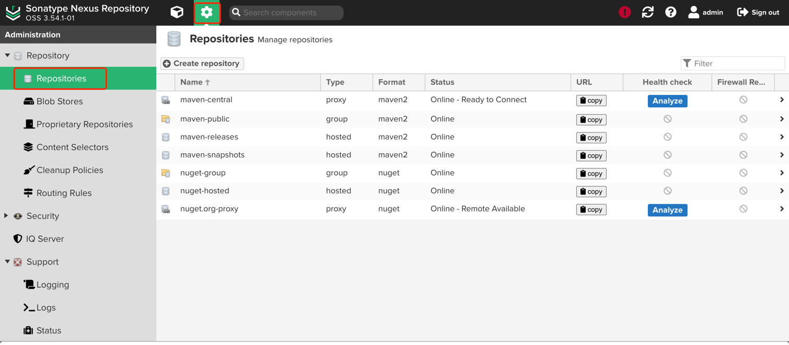
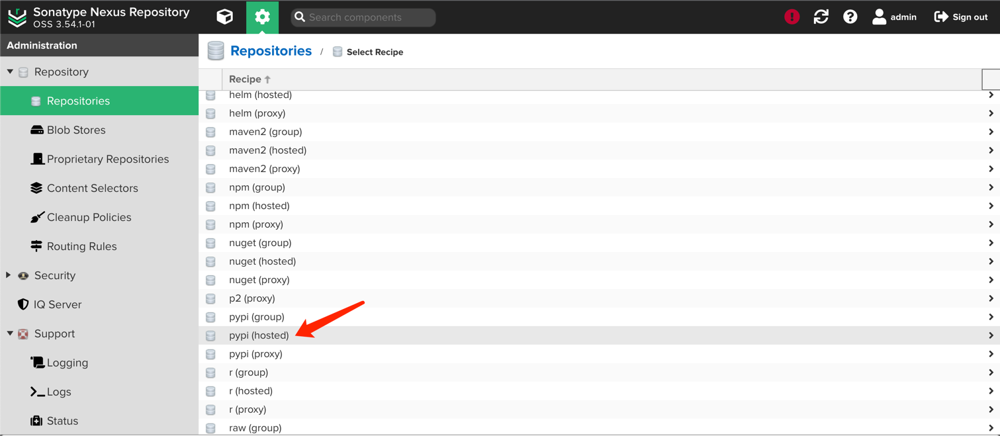
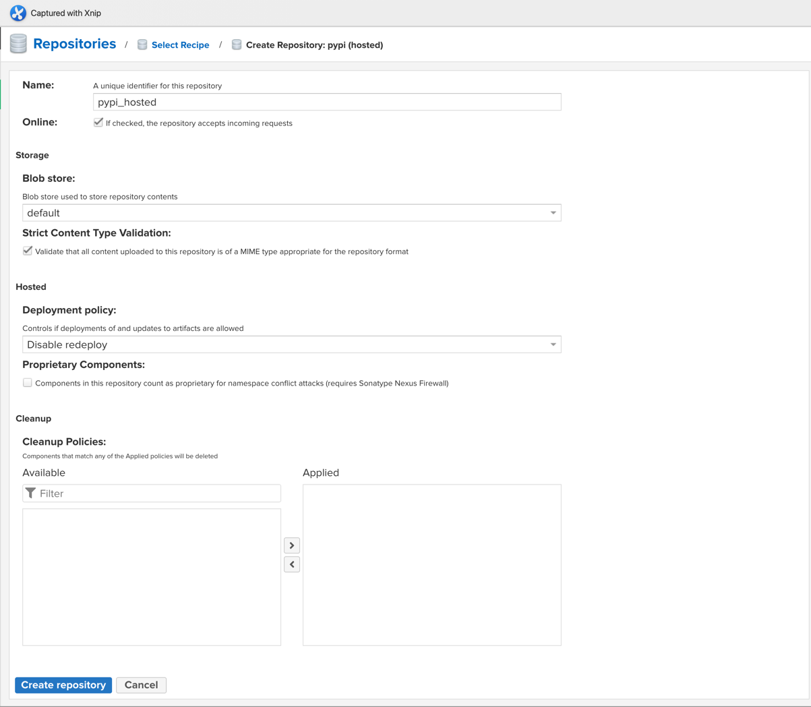
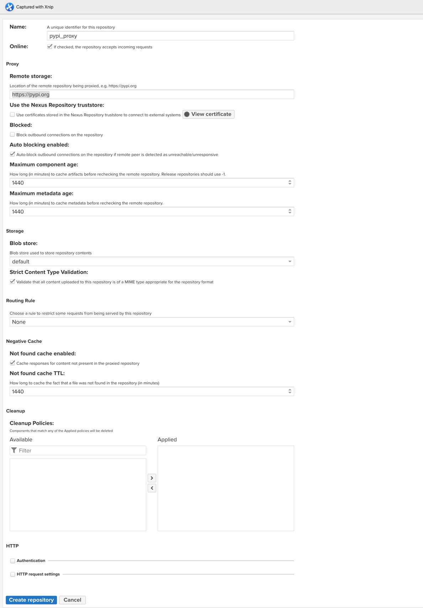
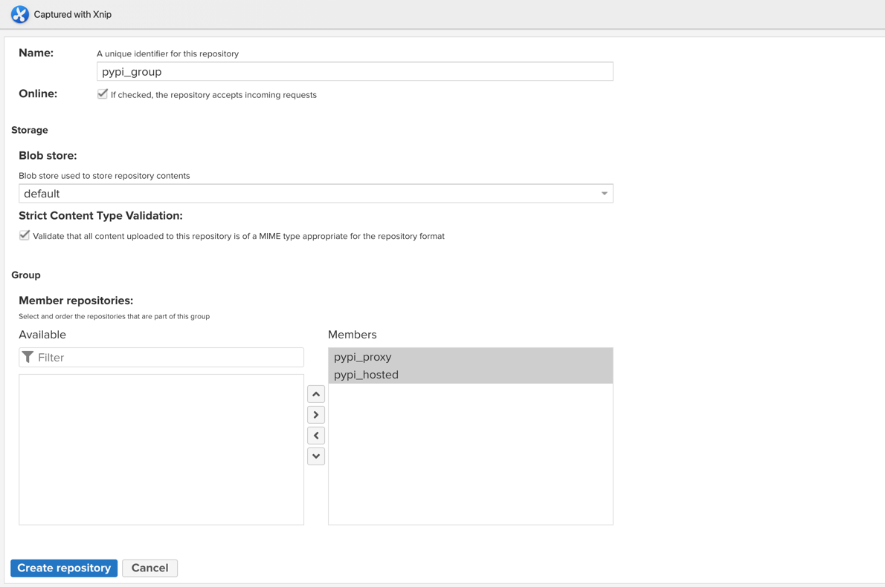
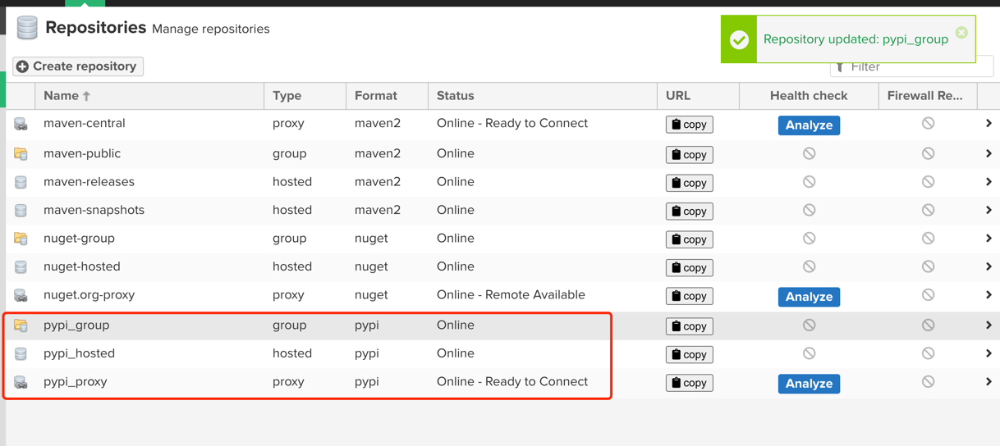
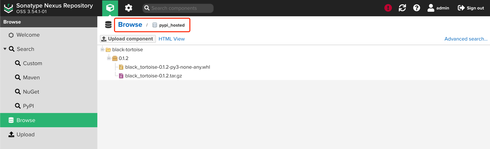
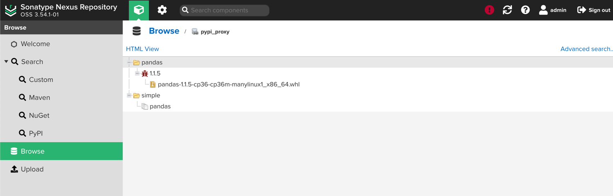

### nexus 私服搭建和部署

```shell

# 运行 nexus
docker run -d -p 8080:8081 --name nexus sonatype/nexus3

# 查看 nexus 运行状态
docker logs -f nexus

查看密码
docker exec -it nexus sh -c "cat /nexus-data/admin.password && echo"
```

* 建议匿名登录

配置搭建私服仓库
1. 选择设置-仓库-创建仓库

2. 点击创建仓库

3. 选择pypi (hosted) 仓库


| 名称   | 内容   |
|------|------|
| name | pypi_hosted | 



点击 创建仓库

4. 选择pypi (proxy) 仓库

| 名称   | 内容   |
|------|------|
| name | pypi_proxy | 
| remote storage | https://pypi.org |

备用源

| 名称  | 内容   |
|-----|------|
| 阿里源 | https://mirrors.aliyun.com/pypi/ |



点击 创建仓库

5. 选择pypi (group) 仓库

| 名称        | 内容            |
|-----------|---------------|
| name      | pypi_group    | 
| available | pypi_hosted 、 pypi_proxy|

选中两个活跃的仓库 pypi_hosted 、 pypi_proxy 


点击 创建仓库



###### 配置 环境变量
```shell
# /etc/profile

export TWINE_REPOSITORY_URL=http://8.130.120.201:8080/repository/pypi_hosted/
export TWINE_USERNAME=admin
export TWINE_PASSWORD=Aa123456
```

执行发布脚本后查看是否上传成功


pip 安装库
```shell
pip3 --trusted-host 8.130.120.201 install pandas --index http://8.130.120.201:8080/repository/pypi_proxy/simple/
```
查看是否有代理成功


###### pip源配置
```shell
mkdir -p $HOME/.pip && echo -e "[global]\nindex-url = http://8.130.120.201:8080/repository/pypi_group/simple/\ntrusted-host = 8.130.120.201" > $HOME/.pip/pip.conf
```

###### 卸载全部库
```shell
pip freeze | xargs pip uninstall -y
```